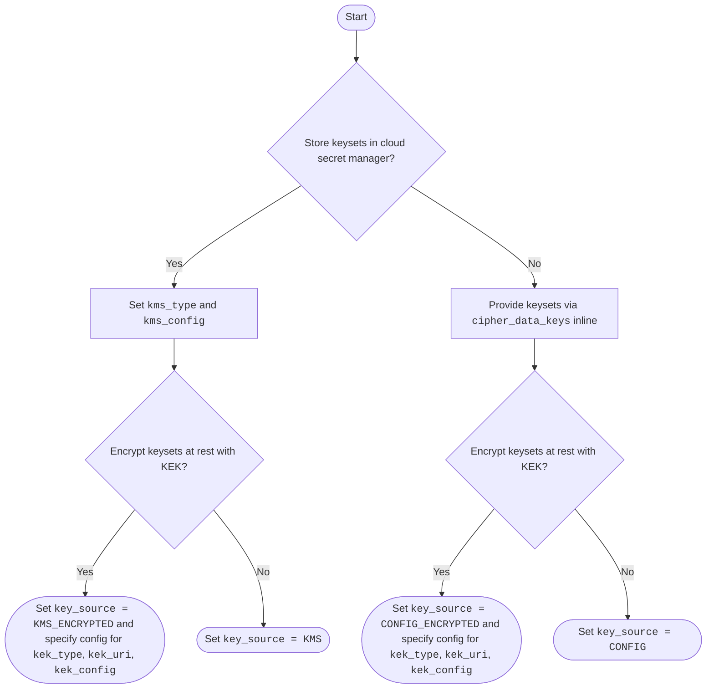

# Cloud KMS Overview

Kryptonite for Kafka supports three cloud KMS providers ([GCP Cloud KMS](https://cloud.google.com/security/products/security-key-management), [AWS KMS](https://aws.amazon.com/kms/), and [Azure Key Vault](https://azure.microsoft.com/en-us/products/key-vault)) each offering two independent capabilities:

| Capability | `kms_type` / `key_source` | Description |
|---|---|---|
| **keyset storage** | `kms_type=<provider>`, `key_source=KMS` or `KMS_ENCRYPTED` | Tink keysets are stored in the cloud secret manager and fetched at runtime |
| **keyset encryption** | `kek_type=<provider>`, `key_source=CONFIG_ENCRYPTED` or `KMS_ENCRYPTED` | Cloud KMS key is used to encrypt/decrypt the keyset material with a key encryption key (KEK) |

!!! note "KMS Storage & Encryption"
    These two capabilities are independent and can be mixed if necessary. For instance, while you could use GCP Secret Manager for keyset storage you might want to use AWS KMS for key encryption purposes.

---

## Cloud KMS Provider Summary

| Provider | Keyset storage (`kms_type`) | Keyset Encryption (`kek_type`) |
|---|---|---|
| [GCP](gcp.md) | `GCP_SM_SECRETS` | `GCP` |
| [AWS](aws.md) | `AWS_SM_SECRETS` | `AWS` |
| [Azure](azure.md) | `AZ_KV_SECRETS` | `AZURE` |

---

## Decision Guide for `key_source`



---

## Service Loader Discovery

KMS modules are **optional runtime dependencies**. The core library discovers available providers at runtime using Java's `ServiceLoader` mechanism. Add the relevant `kryptonite-kms-*` JAR to the classpath alongside the core library to have it auto-discovered.

```
ServiceLoader
  └── KmsKeyVaultProvider      ← keyset storage capability
  └── KmsKeyEncryptionProvider ← keyset encryption capability
```

Each module registers its implementations in `META-INF/services/` descriptor files. If a module JAR is absent from the classpath, the corresponding `kms_type` or `kek_type` values are unavailable. You'd get a runtime exception in case the configured keyset storage or key encryption mechanism can't be found.

---

## Generating KMS-encrypted Keysets

Use the [Keyset Tool](../keyset-tool.md) to generate keysets encrypted with any supported KEK. Pass the `--kek-type`, `--kek-uri`, and `--kek-config` flags along with `-e`.

For `key_source=KMS_ENCRYPTED`, generate in `RAW` format (`-f RAW`) and upload the resulting JSON as the secret value in your cloud secret manager. See [here](../key-management/#secret-naming-conventions) for secret naming conventions.
