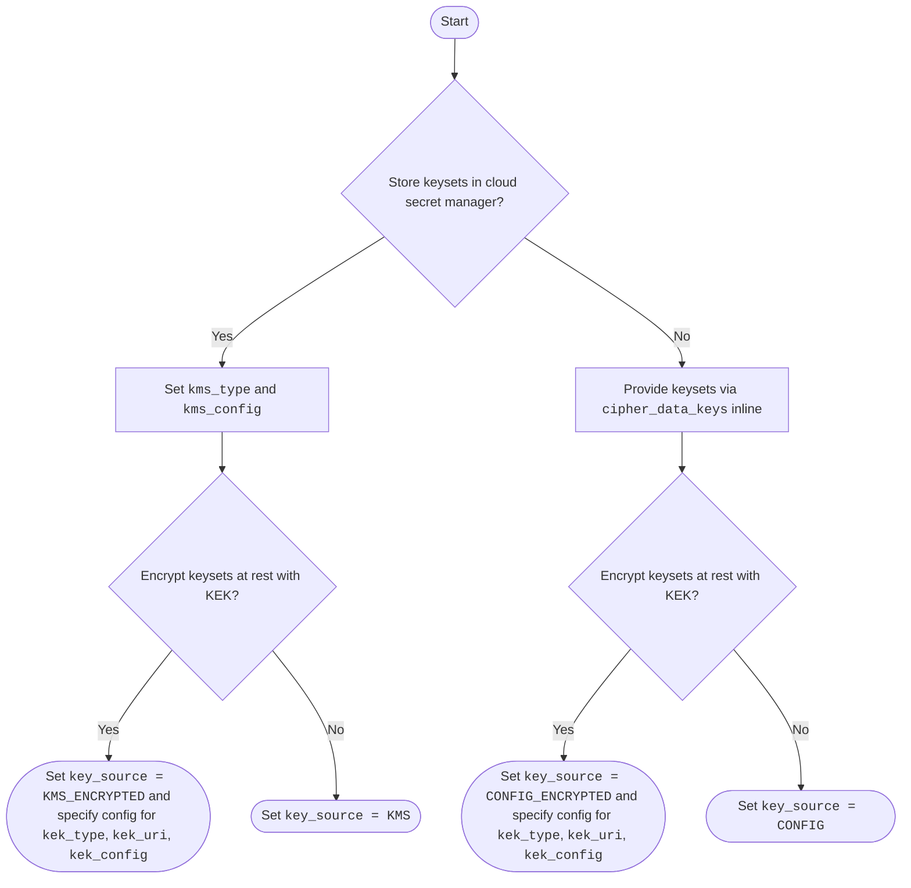

# Cloud KMS Overview

Kryptonite for Kafka supports three cloud KMS providers ([GCP Cloud KMS](https://cloud.google.com/security/products/security-key-management), [AWS KMS](https://aws.amazon.com/kms/), and [Azure Key Vault](https://azure.microsoft.com/en-us/products/key-vault)) each offering three independent capabilities:

| Capability | `kms_type` / `key_source` | Description |
|---|---|---|
| **keyset storage** | `kms_type=<provider>`, `key_source=KMS` or `KMS_ENCRYPTED` | Tink keysets are stored in the cloud secret manager and fetched at runtime |
| **keyset encryption** | `kek_type=<provider>`, `key_source=CONFIG_ENCRYPTED` or `KMS_ENCRYPTED` | Cloud KMS key is used to encrypt/decrypt the keyset material with a key encryption key (KEK) |
| **Envelope KEK** | `envelope_kek_configs`, `cipher_algorithm=TINK/AES_GCM_ENVELOPE_KMS` | Cloud KMS key acts as KEK for envelope encryption |

!!! note "KMS Storage & Encryption"
    These two capabilities are independent and can be mixed if necessary. For instance, while you could use GCP Secret Manager for keyset storage you might want to use AWS KMS for keyset encryption.

!!! tip "Envelope Encryption"
    Cloud KMS keys can also serve as KEKs for field-level envelope encryption (`TINK/AES_GCM_ENVELOPE_KMS`). In this mode a fresh DEK is generated per session, encrypted field data uses the DEK, and the cloud KMS wraps/unwraps the DEK on session boundaries. See [Envelope Encryption](../envelope-encryption.md) for a full explanation.

---

## Cloud KMS Provider Summary

| Provider | Keyset storage (`kms_type`) | Keyset Encryption (`kek_type`) | Envelope KEK (`envelope_kek_configs`) |
|---|---|---|---|
| [GCP](gcp.md) | `GCP_SM_SECRETS` | `GCP` | `GCP` |
| [AWS](aws.md) | `AWS_SM_SECRETS` | `AWS` | `AWS` |
| [Azure](azure.md) | `AZ_KV_SECRETS` | `AZURE` | not yet supported |

---

## Decision Guide for `key_source`


```mermaid
flowchart TD
    A([Start]) --> B{Store keysets in cloud secret manager?}

    B -- Yes --> C["Set <code>kms_type</code> and <code>kms_config</code>"]
    B -- No  --> D["Provide keysets via <code>cipher_data_keys</code> inline"]

    C --> E{Encrypt keysets at rest with KEK?}
    D --> F{Encrypt keysets at rest with KEK?}

    E -- Yes --> G(["Set <code>key_source = KMS_ENCRYPTED</code> and specify config for <code>kek_type</code>, <code>kek_uri</code>, <code>kek_config</code>"])
    E -- No  --> H(["Set <code>key_source = KMS</code>"])

    F -- Yes --> I(["Set <code>key_source = CONFIG_ENCRYPTED</code> and specify config for <code>kek_type</code>, <code>kek_uri</code>, <code>kek_config</code>"])
    F -- No  --> J(["Set <code>key_source = CONFIG</code>"])
```

---

## Service Loader Discovery

KMS modules are **optional runtime dependencies**. The core library discovers available providers at runtime using Java's `ServiceLoader` mechanism. Add the relevant `kryptonite-kms-*` JAR to the classpath alongside the core library to have it auto-discovered.

```
ServiceLoader
  └── KmsKeyVaultProvider          ← keyset storage capability
  └── KmsKeyEncryptionProvider     ← keyset encryption capability (kek_type)
  └── EnvelopeKekEncryptionProvider ← envelope KEK capability (envelope_kek_configs)
```

Each module registers its implementations in `META-INF/services/` descriptor files. If a module JAR is absent from the classpath, the corresponding `kms_type`, `kek_type`, or envelope KEK provider is unavailable and a runtime exception is thrown if it is configured.

---

## Generating KMS-encrypted Keysets

Use the [Keyset Tool](../keyset-tool.md) to generate keysets encrypted with any supported KEK. Pass the `--kek-type`, `--kek-uri`, and `--kek-config` flags along with `-e`.

For `key_source=CONFIG_ENCRYPTED`, generate keysets in `FULL` format (`-f FULL`) and use the resulting JSON for the config setting `cipher_data_keys`.

For `key_source=KMS_ENCRYPTED`, generate keysets in `RAW` format (`-f RAW`) and upload the resulting JSON as the secret value in your cloud secret manager. See [here](../key-management/#secret-naming-conventions) for secret naming conventions.
